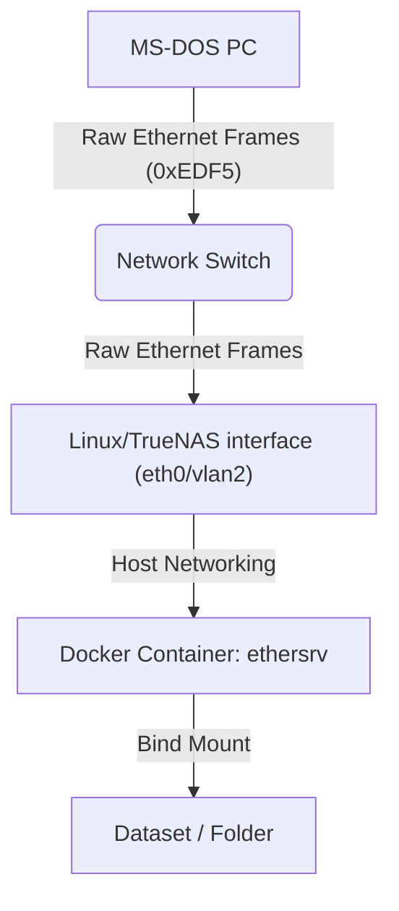

# EtherDFS Server for Docker - with native Long File Name support

A lightweight, containerized **EtherDFS Server** (`ethersrv`) that lets a
vintage MS-DOS PC mount a folder from a modern Linux/NAS host as a local drive
letter over **raw Ethernet**. No TCP/IP stack is required on the DOS side, just a packet driver for the network card.

This is a fork of [oerg866/ethersrv-866](https://github.com/oerg866/ethersrv-866)
(itself a fork of the original [EtherDFS by Mateusz Viste](http://etherdfs.sourceforge.net/)),
optimized for **TrueNAS SCALE / ZFS** and extended with a full **Win95-style
Long File Name (LFN) implementation** - both the Linux daemon *and* a matching
DOS client TSR live in this repository.

> **Highlights of this fork:** true long filenames on the DOS side (not just
> 8.3 aliases), OEM codepage conversion for accented names, deterministic
> `~1` short-name generation on case-sensitive filesystems, unlimited
> directory sizes, and a hardened wire protocol - all validated on real
> hardware (PC DOS 7.10 + 4DOS + Norton/Volkov Commander).

---

## 🌟 Key features

* **Native Long File Name (LFN) support** *(this fork)* - with the bundled DOS
  client (`client/`), DOS gets the full Win95 LFN API on the mapped drive:
  `DIR` shows real long names, and open/copy/`REN`/`DEL`/`MD`/`RD`/`CD`/`ATTRIB`
  and truename all accept long names *and* long intermediate directory
  components. Served by the client TSR hooking `INT 21h/71xx`, backed by
  additive server wire-opcodes (`0x40`-`0x4E`) that an older server safely
  ignores.
* **DOSLFN coexistence** - load DOSLFN first and EtherDFS second, and they
  cooperate cleanly: DOSLFN keeps serving local FAT drives while EtherDFS
  serves its own network drives (it chains other drives down to DOSLFN).
* **OEM codepage conversion** - names are stored UTF-8 on the host but travel
  the wire in the DOS OEM codepage (**CP437** default, **CP850** via
  `ETHERDFS_CODEPAGE`), so accented names such as `Café Menü.txt` display and
  round-trip correctly. Unmappable characters degrade to `_`; 8.3 aliases are
  kept pure 7-bit so they survive DOS's own filename normalization.
* **TrueNAS/ZFS 8.3 SFN compatibility** - a deterministic algorithm generates
  DOS-compatible 8.3 short names (`NAME~1.TXT`) on the fly for long/spaced/
  lowercase names on case-sensitive filesystems, so classic DOS tools never
  crash or fail to open them.
* **Huge directory support** - no fixed 1024-file limit; the server allocates
  dynamically to serve gigantic collections (e.g. eXoDOS, 3500+ items/dir).
* **Adjustable output delay** (`ETHERDFS_DELAY`) - throttle transmission for
  vintage 8086/XT ISA NICs (NE2000/RTL8019) that overflow at Gigabit speeds.
* **Dynamic volume labels** (`VOLUME_LABEL`).
* **Standalone Docker support** - an `entrypoint.sh` that waits for the
  physical interface to appear, preventing container crash-loops.

## 📖 What is EtherDFS?

EtherDFS creates a **Layer-2 (raw Ethernet)** drive mapping for MS-DOS clients.
An old PC (from an 8086/8088 XT up to a Pentium) mounts a host folder as a
drive letter (e.g. `E:`)
using nothing but a packet driver and a ~14 KB TSR.



---

## 🔤 Long File Names - how it works

Classic EtherDFS is an 8.3-only redirector. This fork adds LFN in two halves
that ship together:

| Half | Where | What it does |
| :--- | :--- | :--- |
| **Server** | `ethersrv.c` / `fs.c` | Answers additive LFN wire-opcodes `0x40`-`0x4E` (FindFirst/Next, Open, Create, Rename, Mkdir, TrueName, VolInfo), generates standard Win95 `~N` aliases (matching DOSLFN/Windows), and converts names between UTF-8 (disk) and the OEM codepage (wire). |
| **Client** | `client/` (`ETHERDFS.EXE`) | A resident TSR that hooks `INT 21h` and serves the Win95 LFN API (`71xx`) for its own drives - `714E/714F` FindFirst/Next, `716C` open/create, `7160` truename, `7156/7141/7139/713A/713B/7143/7147` ren/del/md/rd/cd/attrib/getcwd - translating them to the server opcodes or passing them down as 8.3 aliases. |

What works on the DOS side once both are loaded:

* `DIR` shows the real long names (with spaces, mixed case, accents).
* `COPY`, `TYPE`, `REN`, `DEL`, `MD`, `RD`, `CD`, `ATTRIB` all accept long
  names and long directory components (e.g. `COPY x.txt "E:\My Long Dir\"`).
* Long-aware shells and file managers (4DOS, Norton/Volkov Commander) see
  long names natively.

The 8.3 world keeps working unchanged: `COMMAND.COM` and legacy tools still get
stable `NAME~1.EXT` aliases for every long name.

### DOSLFN coexistence & load order

If you also use [DOSLFN](https://www.freedos.org/) for long names on *local*
FAT drives, load it **with the `f-` (fallback-off) switch, before** EtherDFS:

```bat
DOSLFN.COM f-         REM local FAT drives get LFN from DOSLFN; f- makes it
                      REM leave non-local drives to the handler behind it
...
ETHERDFS.EXE :: C-E   REM network drive(s) get LFN from EtherDFS (load last)
```

The `f-` switch matters. DOSLFN's default *fallback mode* tries to synthesize
LFN for drives it cannot read directly - a network redirector like EtherDFS's
included - which mangles directory navigation on that drive (a shell can no
longer leave a subdirectory). `f-` disables that fallback, so DOSLFN keeps
native LFN for local FAT drives and leaves the network drive entirely to
EtherDFS. Loading EtherDFS **last** puts its `INT 21h` hook in front, so LFN
calls for its drives reach EtherDFS directly - including drive-less, current-
directory-relative paths, which it resolves via the DOS SDA + CDS.

EtherDFS serves LFN for *its* drives only, chaining every other drive down to
DOSLFN. (Loading EtherDFS last also
lets it cleanly unload itself with `ETHERDFS.EXE /U`, provided no other TSR -
a telnet server, a resident file manager - hooked `INT 2Fh`/`INT 21h` after it.)

---

## ⚠️ Networking requirements

EtherDFS is pure **Layer 2** - no IP, no subnet, no gateway.

1. **`network_mode: host`** in Docker. Bridge/NAT drops the raw frames; port
   mapping does not apply.
2. **Bind to the real interface** connected to the DOS machine's switch
   (`eth0`, `eno1`, `br0`, `vlan2`, …). The DOS PC and the host must share the
   same Layer-2 segment (VLAN).

## 🚀 Docker setup

### docker-compose.yml

```yaml
services:
  etherdfs:
    image: ghcr.io/megapearl/etherdfs-server:latest
    container_name: etherdfs-server
    network_mode: host          # REQUIRED for raw frames
    cap_add:
      - NET_RAW
      - NET_ADMIN
    environment:
      - INTERFACE=vlan2         # host NIC facing the DOS machine
      - VOLUME_LABEL=RETRO      # optional, max 11 chars
      - ETHERDFS_CODEPAGE=437   # 437 (default) or 850
      - ETHERDFS_DEBUG=0        # keep 0 in production (see table below)
      - ETHERDFS_DELAY=0        # raise for vintage ISA NICs
    volumes:
      - /mnt/tank/retro/dos_games:/data   # host folder -> /data
    restart: unless-stopped
```

## ⚙️ Environment variables

| Variable | Default | Description |
| :--- | :--- | :--- |
| `INTERFACE` | `vlan2` | Host NIC name (e.g. `eth0`, `vlan2`). The container waits gracefully if it doesn't exist yet. |
| `VOLUME_LABEL` | *(dir name)* | Optional DOS volume label (max 11 chars). |
| `ETHERDFS_CODEPAGE` | `437` | OEM codepage for wire↔disk filename conversion. `437` (US/Western) or `850` (Latin-1). |
| `ETHERDFS_DEBUG` | `0` | `1` = verbose per-operation logging to stdout. **Leave `0` in production**: the output is large, and if the Docker log driver applies backpressure the single-threaded server blocks on `write()` for seconds, which DOS clients see as timeouts (spurious "File not found", drive errors). |
| `ETHERDFS_DELAY` | `0` | Artificial TX delay in ms. Raise (e.g. `5`) if a vintage NIC's buffers overflow during large transfers. |

*(The shared folder must be mounted exactly at `/data`.)*

---

## 💾 Client setup (MS-DOS)

You need two things on the vintage PC:

1. A **packet driver** for your NIC (`NE2000.COM`, `3C509.COM`, `E100BPKT.COM`, …).
2. The **EtherDFS client** - a prebuilt `ETHERDFS.EXE` ships in
   [`client/bin/`](client/bin/).

### AUTOEXEC.BAT example

```bat
@ECHO OFF
REM 1. Load the packet driver (vector 0x60 is conventional)
C:\NET\3C509.COM 0x60

REM 2. (optional) DOSLFN for LFN on LOCAL FAT drives -- load with f- (fallback
REM    off, so it leaves the network drive to EtherDFS) and BEFORE EtherDFS
C:\NET\DOSLFN.COM f-

REM 3. Load EtherDFS -- ":: " auto-discovers the server; "C-E" maps remote C: to local E:
C:\NET\ETHERDFS\ETHERDFS.EXE :: C-E
```

`ETHERDFS.EXE /U` unloads the resident driver (only if it is still on top of
the `INT 2Fh`/`INT 21h` chains - see *DOSLFN coexistence* above).

---

## 🛠️ Building from source

### Server (Linux daemon)

Native build (needs `gcc`, `make`, `libpcap-dev`):

```bash
make                    # produces ./ethersrv; version is derived from git
sudo ./ethersrv -f -v RETRO eth0 /srv/dos
```

The version string is **not hardcoded** - `make` derives it from the git tags
(`git describe --tags --always --dirty`). Override with `make VERSION=vX.Y.Z`
when building outside a git checkout.

Or build the container (the release build injects the version via a build arg):

```bash
docker build -t etherdfs-server .                     # version = "unknown" (no git in context)
docker build --build-arg APP_VERSION=$(git describe --tags) -t etherdfs-server .
```

### Client (DOS TSR)

The 16-bit client is built with the **OpenWatcom v2** cross-compiler. A helper
script drives a containerized build (no host toolchain needed):

```bash
# runs OpenWatcom in a container and emits client/bin/ETHERDFS.EXE. The
# optional version arg is stamped into the banner (pass a git tag); without
# it the client reports "unknown".
sh client/build-linux.sh "$(git describe --tags)"
```

### Prebuilt binaries

Prebuilt binaries for both halves are committed for convenience, built from the
current release tag:

* **DOS client:** [`client/bin/ETHERDFS.EXE`](client/bin/ETHERDFS.EXE)
* **Linux `ethersrv` daemon** ([`bin/`](bin/)) - statically linked (musl, no
  runtime dependencies), one per architecture:

| File | Architecture |
| :--- | :--- |
| [`bin/ethersrv-linux-x86_64`](bin/ethersrv-linux-x86_64) | 64-bit x86 (x86-64 / amd64) |
| [`bin/ethersrv-linux-i686`](bin/ethersrv-linux-i686) | 32-bit x86 (i686 / i386) |
| [`bin/ethersrv-linux-aarch64`](bin/ethersrv-linux-aarch64) | 64-bit ARM (aarch64 / arm64) |
| [`bin/ethersrv-linux-armv7`](bin/ethersrv-linux-armv7) | 32-bit ARM (armv7 / armhf) |

Being statically linked, each runs as-is on its architecture without libpcap or
a matching libc installed:

```bash
chmod +x ethersrv-linux-x86_64
sudo ./ethersrv-linux-x86_64 -f -v RETRO eth0 /srv/dos
```

---

## 🔧 Troubleshooting

**"Error: failed to scan dir" / empty drive** - almost always host permissions.
Ensure the dataset is readable by the container (which runs as root):
```bash
chmod -R 755 /mnt/tank/retro
```

**Client locks up during large transfers** - a vintage ISA NIC being
out-run by a Gigabit host. Set `ETHERDFS_DELAY=5` (or higher).

**Intermittent "File not found" / drive errors under load** - check that
`ETHERDFS_DEBUG` is `0`. Verbose logging under heavy client traffic can stall
the (single-threaded) server via log-driver backpressure.

**Making a directory fails: DOS Navigator's F7 silently does nothing, or
`MD X:\DIR` hangs** - both are client bugs fixed in v1.1.2: DN OSP expands the
new name through LFN TRUENAME (7160h/CL=0), which older clients returned
without a drive letter (DN then aborts before any DOS call), and a legacy
`AH=39h` MkDir used to fall through to DOSLFN, which hangs trying direct
sector I/O on the mapped drive. Update `ETHERDFS.EXE` to v1.1.2 or later.

**Norton Commander's F3 viewer says "file not found" for every file on the
mapped drive (F4 works)** - a client bug fixed in v1.1.3. The client used to
resolve a bare relative filename against the CDS of the drive of the *current
DOS operation* instead of the default drive. Once an application had just
touched another drive - NC loads `C:\APPS\NC\NCVIEW.MSG` immediately before
asking for the true name of the file - the client declined the call, DOSLFN took
it over and mangled it. Update `ETHERDFS.EXE` to v1.1.3 or later.

**Accented name shows as `_` or won't open** - set `ETHERDFS_CODEPAGE` to
match your DOS box's active codepage (`437` or `850`).

**7-Zip (DJGPP) "No such file" on a name with several dots** - e.g.
`x (1.2.3).7z`. DJGPP-built tools reject multi-dot names on a *network* drive
locally, before any server request (they treat local drives differently). This
is a DJGPP limitation, not an EtherDFS one: `DIR`, `COPY` and file managers
handle such names fine. Work around it by extracting on a local drive, renaming
to a single dot, or passing the file's 8.3 alias.

---

## 📜 Credits & license

* **Original author:** [Mateusz Viste](https://etherdfs.sourceforge.net/) - EtherDFS + `ethersrv-linux`
* **Linux/FreeBSD fork:** [Michael Ortmann (oerg866)](https://github.com/oerg866/ethersrv-866/)
* **Dockerization, ZFS/8.3 SFN, LFN + codepage fork:** [Donald Flissinger](https://github.com/megapearl/etherdfs-server/)

Distributed under the **MIT License** - see [`LICENSE`](LICENSE). The 8.3-alias,
LFN and codepage additions are contributed under the same terms.
