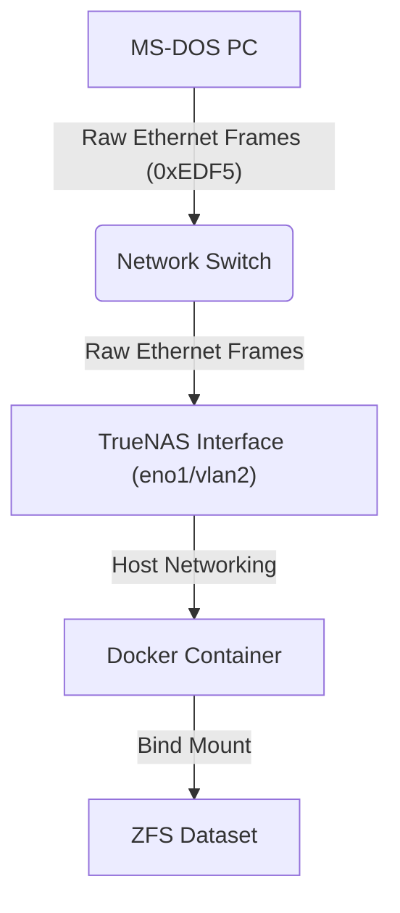

# EtherDFS Server for Docker

A lightweight, containerized version of the **EtherDFS Server** (`ethersrv`), heavily optimized to run on modern NAS systems like **TrueNAS Scale** and other Linux Docker environments.

This repository hosts a fork based on [oerg866/ethersrv-866](https://github.com/oerg866/ethersrv-866), an actively maintained version of the original [EtherDFS by Mateusz Viste](http://etherdfs.sourceforge.net/).

## 🌟 Key Improvements in this Version
* **TrueNAS/ZFS 8.3 SFN Compatibility:** Added a custom algorithm to generate DOS-compatible 8.3 Short File Names (`~1`) on the fly. This prevents DOS clients from crashing or failing to access files with long names, spaces, or lowercase letters on case-sensitive filesystems like ZFS. 
* **Native Long File Name (LFN) support:** With the bundled client (`client/`), DOS gets the full Win95-style LFN API on the mapped drive: `DIR` shows real long names, and open/copy/`ren`/`del`/`md`/`rd`/`cd`/`attrib`/truename all accept long names and long directory components (INT 21h `71xx` served by the client TSR; additive wire opcodes `0x40-0x4E`). Works alongside DOSLFN (load DOSLFN first, EtherDFS last): DOSLFN keeps serving local FAT drives, EtherDFS serves its own network drives. Tested with 4DOS 8.00 + PC DOS 7.10 + Norton Commander.
* **OEM codepage conversion:** Filenames are stored as UTF-8 on the NAS but travel the wire in the DOS OEM codepage (CP437 by default, CP850 via `ETHERDFS_CODEPAGE`), so accented names (`Café Menü.txt`) display and round-trip correctly on both sides. Unmappable characters degrade to `_`.
* **Huge Directory Support:** Removed the rigid 1024-file limit for Short File Name caching. The server now dynamically allocates memory to reliably support gigantic DOS collections (like eXoDOS with 3500+ items per directory) without returning "Invalid directory" errors.
* **Adjustable Output Delay:** Added an optional delay parameter (`ETHERDFS_DELAY`) to slow down server packet transmission, preventing buffer overruns on vintage 8086/XT network cards (like the NE2000).
* **Dynamic Volume Labels:** Serve custom volume labels to your DOS machine (e.g. `RETRO`) via the `VOLUME_LABEL` environment variable.
* **Runtime Debugging:** Easily inspect DOS file operations and client connections by setting `ETHERDFS_DEBUG=1` without being overwhelmed by raw ethernet frame hexadecimal dumps. 
* **Standalone Docker Support:** Includes an intelligent `entrypoint.sh` script to wait for physical interfaces to come online before starting, preventing container crash loops. 

## 📖 What is EtherDFS?
EtherDFS creates a **Layer 2 (Raw Ethernet)** drive mapping for MS-DOS clients. It allows an old PC (8086 to Pentium) to mount a folder from your modern NAS as a local drive letter (e.g., `E:`), without requiring a heavy TCP/IP stack.



## ⚠️ Critical Networking Requirements

EtherDFS operates entirely on **Layer 2**. It does **not** use IP addresses (no IP, no Subnet, no Gateway).

1. **Network Mode: Host**: You **MUST** use `network_mode: host` in Docker.
   * Bridge mode or NAT will block the raw Ethernet frames.
   * Port mapping (`-p 80:80`) is not applicable here.

2. **Physical Interface**: You must bind the application to the *actual* network interface of the host that is connected to the DOS machine's switch (e.g., `eno1`, `eth0`, `br0`, `vlan2`).

## 🚀 Docker Setup

### docker-compose.yml 

```yaml
services:
  etherdfs:
    image: ghcr.io/megapearl/etherdfs:latest
    container_name: etherdfs-server
    # CRITICAL: Must be host mode to receive raw frames
    network_mode: host
    # Capabilities needed to open raw sockets
    cap_add:
      - NET_RAW
      - NET_ADMIN
    environment:
      # Set to your primary network interface connected to the DOS machine
      - INTERFACE=vlan2
      # Provide a custom 11-character DOS volume label (Optional)
      - VOLUME_LABEL=RETRO
      # Enable verbose logging of file operations (Optional, 0 or 1)
      - ETHERDFS_DEBUG=0
      # Slow down packet transmission for older XT network cards (milliseconds) 
      - ETHERDFS_DELAY=0
    volumes:
      # Format: /path/on/host:/data
      - /mnt/tank/retro/dos_games:/data
    restart: unless-stopped
```

## ⚙️ Environment Variables

| Variable | Default | Description |
| :--- | :--- | :--- |
| `INTERFACE` | `vlan2` | The physical network interface name on the docker host (e.g., `eth0`, `vlan2`). The container will wait gracefully if the interface doesn't exist yet. |
| `VOLUME_LABEL` | `(directory name)`| An optional custom DOS Volume Label (max 11 chars). If omitted, the root directory name is capitalized and used. |
| `ETHERDFS_DEBUG`| `0` | Set to `1` to enable verbose logging of DOS operations (`AL_OPEN`, `AL_READ`, `AL_FINDNEXT`) to stdout. Excellent for troubleshooting. **Do not leave enabled in production**: the per-query output is large, and if the Docker log driver applies backpressure the (single-threaded) server blocks on `write()` for seconds, which DOS clients experience as timeouts ("File not found", drive errors). |
| `ETHERDFS_CODEPAGE`| `437` | OEM codepage used to convert filenames between the UTF-8 filesystem and the DOS wire. Supported: `437` (US/Western, default) and `850` (Latin-1). |
| `ETHERDFS_DELAY`| `0` | Artificial network transmission delay in milliseconds (e.g. `5` or `10`). Increase this if your DOS PC crashes or halts during large file transfers due to full NIC buffers. |

*(Note: The container expects the shared directory to be mounted exactly at `/data`).*

## 🔧 Troubleshooting & Common Issues

### 1. "Error: failed to scan dir" / Empty Drive on Client
This is almost always a **Permissions** issue on the Host (TrueNAS).
* **Cause:** The container runs as root, but TrueNAS NFSv4 ACLs might still block access.
* **Fix:** Ensure the underlying dataset is readable.
```bash
# Run on TrueNAS Shell
chmod -R 755 /mnt/tank/retro
```

### 2. Client crashes or locks up while reading large files
Older XT machines with ISA network cards (like the NE2000 or RTL8019) can sometimes have their buffers overflowed by the speed of modern Gigabit NAS servers.
* **Fix:** Set `ETHERDFS_DELAY=5` in your `docker-compose.yml` to slow down the server's response rate slightly. 

## 💾 Client Setup (MS-DOS)

On your vintage PC, you need two things:

1. A **Packet Driver** for your network card (e.g., `NE2000.COM`, `3C509.COM`).
2. The **EtherDFS Client** (`ETHERDFS.EXE`).

### `AUTOEXEC.BAT` Example

```bat
@ECHO OFF
REM 1. Load your packet driver (vector 0x60 is standard)
C:\APPS\NET\3C509.COM 0x60

REM 2. Load EtherDFS (automatically finds the server)
REM Syntax: ETHERDFS SRVMAC rdrv-ldrv
C:\APPS\ETHERDFS\ETHERDFS.EXE :: C-E
```

If successful, you will see output similar to:
```text
EtherDFS v0.8.3 installed (local MAC 00:A0:24:99:7E:7A, pktdrvr at INT 60)
E: -> [C:] on 00:50:56:85:89:9D
```

## 📜 Credits

* **Original Author:** [Mateusz Viste](https://etherdfs.sourceforge.net/)
* **Linux/FreeBSD Fork:** [Michael Ortmann](https://github.com/oerg866/ethersrv-866/)
* **Dockerization & SFN Enhancements:** [Donald Flissinger](https://github.com/megapearl/etherdfs/)
